# ClauseChain — AI Tool for Digital Trade Regulatory Analysis

UN Global Hackathon on AI for Digital Trade Regulatory Analysis
Team: **Team zAI BD** | Round: **Final**
Last updated: 2026-09-30

> ClauseChain reads an economy's official legislation, finds the provisions that matter for the RDTII 2.1
> indicators, and records each one with an article-level citation, a verbatim quote and the official source it
> came from, for signed human review. One pipeline runs on two model backends, switched inside the app:
> a commercial hosted model (Engine A) and an open-weights model (Engine B).
>
> **Start here:** [Quick Start](#quick-start) (one command, Docker only) · full guide: [DEPLOYMENT.md](DEPLOYMENT.md)

---

## What This Tool Does

This tool automates two tasks required by the ESCAP Regional Digital Trade Integration Index (RDTII 2.1):

**Task 1 — Automated Evidence Discovery**
Given an economy and a pillar, the tool downloads the relevant legislation from official government portals
(including scanned and image-based PDFs, which go through OCR), archives the exact bytes with a SHA-256 hash and
access date, and extracts clean, structured provision text into a legal graph — with no manual steps in the app.

**Task 2 — Intelligent Mapping and Categorisation**
Each candidate provision is mapped to an RDTII indicator by a language model working from the indicator's legal
test, then checked by deterministic gates (the quote must exist byte-for-byte in the archived source, the
location must resolve, the source must be official and in force) and by an adversarial second pass before any
human sees it. Each row carries an article-level citation, a verbatim snippet, and a Discovery Tag: **NEW**
(found independently) or **KNOWN** (matches the baseline we hold).

**Mandatory pillars:** 6 (Cross-border data policies) and 7 (Domestic data protection and privacy).
**Third pillar:** 2 (Public procurement).
**Economies covered (10):** Singapore, Malaysia, Australia, Thailand, India, Indonesia, Russian Federation,
Mongolia, Lao PDR, Timor-Leste — each on pillars 2, 6 and 7, with both engines.

**Ready for the live test.** Of the nine economies in the 2025 RDTII database, ClauseChain has been run end to
end on **six**: Thailand, Indonesia, India, Lao PDR, Mongolia and the Russian Federation (pillars 2, 6 and 7,
both engines). It has **not** been run on Viet Nam, China or Kazakhstan: adding one is data, not code — a
jurisdiction file and a seed list — then **Runs → Build sources** in the app. Pillars other than 2, 6 and 7
need their indicator rubric added the same way (see [Known Limitations](#known-limitations)).

---

## Quick Start

ClauseChain installs with **one command**. Docker is the only prerequisite: Python, Node, PostgreSQL and every
library are pinned inside the images, so the result is identical on macOS, Windows and Linux. The step-by-step
guide with troubleshooting is **[DEPLOYMENT.md](DEPLOYMENT.md)**.

### 1. Clone the repository

    git clone --progress https://github.com/nafew0/clausechain-escap.git
    cd clausechain-escap

### 2. Set up the environment

Install and start **Docker** — [Docker Desktop](https://docs.docker.com/desktop/) on macOS or Windows, or
[Docker Engine](https://docs.docker.com/engine/install/) with the compose plugin on Linux. Nothing else.

Needs 30 GB of free disk and 8 GB of memory for Docker (Docker Desktop's default on a 16 GB machine).

### 3. Configure

**ESCAP reviewers:** our filled-in **`keys.env`** is attached to our submission in ESCAP's Jotform. Download it
from there and put it in the `clausechain-escap` folder you cloned in step 1 (**recommended**: the script finds
it there by default). It sets our two declared engines and the OCR engine — see
**[Your Two Declared Engines](#your-two-declared-engines)** below.

    cp ~/Downloads/keys.env .                     # Windows: Copy-Item $HOME\Downloads\keys.env .

If that command fails — the browser saved the file somewhere else, or under another name such as
`keys (1).env` or `keys.env.txt` — copy the downloaded file into the `clausechain-escap` folder by hand
(drag it there in Finder or File Explorer) and make sure it is named exactly `keys.env`. Or leave it where it
is and type its path when the script asks for the keys file.

To write your own keys file instead: `cp engine/.env.example keys.env` and fill it in. The app's own secrets —
database password, signing keys — are generated for you in step 4.

### 4. Start the interface

    ./deploy.sh

Windows (PowerShell): `powershell -ExecutionPolicy Bypass -File .\deploy.ps1`

The script asks for the port, the keys file (default: `keys.env` in this folder), the data bundle (full 3.3 GB
or partial 1.3 GB) and whether to build, each with a default — press Enter to accept it. It then downloads the
data with a progress bar and verifies its checksum, builds and starts the app, loads both engines' results and
the signed review decisions, and creates an admin account. The first run takes about 20 minutes, mostly
downloading and building (measured: 1,089 seconds on a fresh Windows machine). No questions at all:
`./deploy.sh --yes`.

At the end it shows the admin login (URL, username `admin`, password) in a highlighted box and asks you to
save it; it is also kept in `.deploy-credentials.txt`. Open **http://localhost:8080** and sign in.
**Everything else happens in the interface** — starting a run, reviewing, correcting, switching engines,
exporting.

### 5. Verify

Run **Mongolia** on **pillar 6** from the interface: **Runs** → economy *Mongolia*, pillar *6* → **Build
sources** → **Queue run**. Expected with Engine A: **8 provisions in about 1–2 minutes**, written to
`engine/outputs/`, then **Refresh snapshot** brings them into Review. **Build sources** reports every document
as already downloaded, because the data bundle carries them.

If a run fails with `OPENAI_API_KEY is not set`, the keys are missing: add them to `engine/.env`, then run
`docker compose restart engine-worker backend`.

---

## Your Interface

| What a reviewer needs to do | Where it is |
| :---- | :---- |
| Start a run and watch progress in plain words | **Runs** → choose economy and pillar → **Build sources**, then **Queue run**. The live log under *Engine worker actions* reports each step in words ("downloaded · Law on Personal Data · 412 KB PDF", "embedding 1,204 new provisions", each indicator as it is mapped). |
| Open the audit view: a result beside the source text it came from | **Review** → select a finding → **Source Match**: the extracted row beside the archived official page, with the verbatim quote highlighted at the cited article. |
| Follow a row to its official source at the cited article | **Review** → select a finding → **Act reference** and the official source link, which open the government portal URL recorded for that row (with its section anchor or page where the portal has one). |
| Accept, reject or correct a row | **Review** → the NEW, KNOWN and Absence queues → **Approve** or **Reject** at each stage (citation, mapping, status), or **Request correction** with a note. **Zone-3** → approve or override an indicator score. Every decision is signed with the reviewer's name. |
| Switch the AI engine | The **Hybrid \| Local** tabs at the top of every page. **Runs** → **Local** tab → **Queue run** runs on Engine B. |
| Export to the RDTII schema | **RDTII Matrix** → **Export** → **Excel workbook** (ESCAP's final-round template: Output Data and Coverage Matrix), **CSV** or **JSON**. |

**Walkthrough recording:** submitted with our Word document on 30 September 2026.

---

## Your Two Declared Engines

| | Engine A — commercial hosted | Engine B — open weights |
| :---- | :---- | :---- |
| Provider and model | OpenAI **gpt-6-luna**; embeddings OpenAI **text-embedding-3-small** | **Qwen3.8-27B** (Unsloth NVFP4 quantisation) served by vLLM; embeddings **BAAI bge-m3** |
| Version / checkpoint | `gpt-6-luna` (API model id); runs before 30 Sep 2026 reached the same model through OpenRouter as `openai/gpt-6-luna` | `unsloth/Qwen3.8-27B-NVFP4` |
| Local or hosted API | Hosted API (`api.openai.com`) | Self-hosted on our own GPU (NVIDIA DGX Spark) behind an OpenAI-compatible endpoint. Any OpenAI-compatible server works: vLLM, Ollama `/v1`, a hosted open-weights API. |
| Config value | `HYBRID_LLM_PROVIDER=openai` `HYBRID_LLM_MODEL=gpt-6-luna` | `LOCALAI_ENDPOINT=<server>/v1` `LOCALAI_MODEL=<id the server expects>` `LOCALAI_MODEL_LABEL=unsloth/Qwen3.8-27B-NVFP4` |

Both engines run the **same** pipeline, gates and output schema; only the models differ. Engine B has no
proprietary fallback at any step: if its server fails, the run fails rather than silently calling a commercial
API.

### Switching between them

In the interface: **any page** → the **Hybrid | Local** tabs → select the engine. On **Runs**, the selected tab
decides which engine a queued run uses; on every other page it selects that engine's workspace (results,
review queues, matrix). The two workspaces are kept fully separate and meet only on **Model Comparison**, which
sets Engine A beside Engine B for the same economy and pillar.

The underlying abstraction lives in `engine/packages/providers/llm_providers.py` (`build_llm`), with the two
profiles in `engine/configs/models.yaml` (`hybrid_accuracy`, `local_openweights`). Adding a provider means
setting `LOCALAI_ENDPOINT` / `LOCALAI_MODEL` for any OpenAI-compatible server (no code), or adding one branch to
`build_llm` for a different API.

### Re-running without fetching

Fetching and reading are separate actions. **Build sources** is the only step that downloads; **Queue run**
reads the archived corpus and fetches nothing.

In the interface: **Runs** → **Queue run** (reads only), or **Build sources** again — documents already
downloaded are skipped ("already downloaded"), so its downloaded-documents list in the Run Record is empty.
Where downloaded documents are cached: `engine/data/raw/<economy code>/` (bytes, with `seeds_manifest.json`
recording URL, SHA-256 and access date), parsed into `engine/data/graph_v2.db`.

---

## Crawling Politely

ClauseChain does not crawl whole sites. It downloads only the specific official documents listed in its seed
files (`engine/data/seeds.json`, `engine/data/seeds_r2.json`), once each: a document downloaded successfully is
never requested again.

| Setting | Value | Where it is set |
| :---- | :---- | :---- |
| Max requests per second per host | One document at a time, with a 3-second pause before each | `engine/packages/connectors/seeds_fetch.py:30` (`POLITE_DELAY_S`), applied at `:282` |
| Parallel requests per host | 1 (a single connection, documents fetched in sequence) | `engine/packages/connectors/seeds_fetch.py:241` |
| robots.txt respected | Not parsed; only the listed document URLs are requested, and no links are followed | `engine/packages/connectors/seeds_fetch.py:214` (`fetch_seeds`) |

---

## Architecture Overview

The boundary between **fetching** (left) and **reading** (right) is explicit: runs read only the archive, which
is what makes a second pass fetch nothing.

```mermaid
flowchart LR
    subgraph FETCH["Fetching — Runs → Build sources"]
        S["Seed list<br/>official URLs per economy"] --> F["Polite fetcher<br/>one document at a time"]
        F --> A[("Archive<br/>engine/data/raw/&lt;cc&gt;<br/>bytes + SHA-256 + date")]
    end
    subgraph READ["Reading — Runs → Queue run (no network to portals)"]
        A --> X["Extractors + OCR<br/>HTML / PDF / EPUB, scanned pages"]
        X --> G[("Legal graph<br/>graph_v2.db: act → section → provision")]
        G --> R["Hybrid retrieval<br/>exact phrase + BM25 + embeddings"]
        R --> M["Mapper<br/>Engine A or Engine B"]
        M --> V["Gates G1–G9<br/>byte-exact quote, location,<br/>official source, in force"]
        V --> O["Run output<br/>engine/outputs/&lt;run&gt;"]
    end
    O --> P["Refresh snapshot<br/>adversarial refuter, Zone-3 scores"]
    P --> H["Human review<br/>signed decisions"]
    H --> E["Export<br/>RDTII final-round template"]
```

### Key modules

| Module | File | Description |
| :---- | :---- | :---- |
| Portal Crawler | `engine/packages/connectors/seeds_fetch.py` | Seed-list download with archive, SHA-256 and access date; browser fallback for script-rendered portals |
| Document Processor | `engine/packages/extractors/` (`html_act.py`, `pdf_act.py`, `epub_act.py`, `pdf.py`) · `engine/packages/providers/ocr_provider.py` | Download → native text or OCR → sections and provisions with anchors and page numbers |
| Retrieval | `engine/packages/retrieval/hybrid.py` | Exact phrase ∪ FTS5/BM25 ∪ dense embeddings, disk-cached per model |
| Mapper | `engine/packages/rdtii/mapper.py` | Screens candidates and maps a provision to an indicator from the rubric (`engine/configs/rdtii/pillar_N.yaml`) |
| Interface | `frontend/src/` (Next.js) · `backend/workspace/` (Django API, engine worker) | Run control, audit view, review, comparison, export |
| Output Writer | `engine/packages/export/final_round.py` · `csv_writer.py` · `json_writer.py` | Writes the RDTII final-round schema; per-run CSV and JSON |

Also: `engine/packages/verifier/gates.py` (gates G1–G9), `engine/packages/core/orchestrator.py` (the pipeline),
`engine/scripts/apply_decisions.py` (the only writer of signed decisions), `engine/scripts/submission_replay.py`
(approved decisions → final dataset).

---

## Swapping the OCR Engine

OCR runs only on pages without a text layer; text PDFs and web pages need none. Swapping is a setting in
`engine/.env`, no code.

| Engine | Config value | Notes |
| :---- | :---- | :---- |
| PaddleOCR, self-hosted (our default) | `OCR_PROVIDER=remote_paddle` `OCR_ENDPOINT=…` `OCR_API_KEY=…` | Open source, runs on our own server. No proprietary API. |
| Tesseract, local | `OCR_PROVIDER=tesseract` | Open source, key-free. |
| Google Cloud Vision | `OCR_PROVIDER=google_vision` `GOOGLE_VISION_API_KEY=…` | **Proprietary**, optional. |
| PaddleOCR with Vision escalation | `OCR_PROVIDER=hybrid_script` | Paddle first; **proprietary** Vision only for scripts Paddle reads poorly. Optional. |

The core pipeline runs with no proprietary API: Engine B plus PaddleOCR or Tesseract. No separate translation
service is used; verbatim quotes stay in the source language.

---

## Supported Economies and Portals

| Economy | Official portal | Language | Run end to end? | Notes |
| :---- | :---- | :---- | :---- | :---- |
| Singapore | sso.agc.gov.sg · pdpc.gov.sg · imda.gov.sg | English | Yes: P2, P6, P7 · both engines | Engine A's P6/P7 runs are Round 1 (Jul 2026) |
| Malaysia | lom.agc.gov.my · pdp.gov.my · mcmc.gov.my · myipo.gov.my | English / Malay | Yes: P2, P6, P7 · both engines | Bilingual PDFs; Malay citation grammar; Engine A's P6/P7 runs are Round 1 |
| Australia | legislation.gov.au · treasury.gov.au · dfat.gov.au | English | Yes: P2, P6, P7 · both engines | Engine A's P6/P7 runs are Round 1; dfat.gov.au blocks automated access (see limitations) |
| Thailand | ratchakitcha.soc.go.th · gprocurement.go.th · bot.or.th | Thai | Yes: P2, P6, P7 · both engines | Royal Gazette PDFs; "มาตรา" citations |
| India | egazette.gov.in · meity.gov.in · rbi.org.in · dot.gov.in | English (Hindi) | Yes: P2, P6, P7 · both engines | Gazette notifications |
| Indonesia | peraturan.bpk.go.id · jdih.komdigi.go.id · ojk.go.id · bi.go.id | Indonesian | Yes: P2, P6, P7 · both engines | "Pasal" citations |
| Russian Federation | pravo.gov.ru | Russian | Yes: P2, P6, P7 · both engines | Browser-rendered pages; inserted articles ("Статья 18¹") kept |
| Mongolia | legalinfo.mn | Mongolian | Yes: P2, P6, P7 · both engines | Official PDF export of each law |
| Lao PDR | laoofficialgazette.gov.la · ppmd.mof.gov.la · bol.gov.la | Lao | Yes: P2, P6, P7 · both engines | Official Gazette |
| Timor-Leste | mj.gov.tl · timor-leste.gov.tl · anc.tl | Portuguese (Tetum) | Yes: P2, P6, P7 · both engines | Jornal da República |

Each economy is a jurisdiction file (`engine/configs/jurisdictions/<cc>.yaml`: portals, languages, citation
grammar) plus its seed rows. The engine code is the same for all ten.

---

## Output Format

The export (**RDTII Matrix → Export**) writes these columns in this exact order — the same schema as Round 1,
plus Language of Source. Indicator IDs are written as text.

| # | Column | Required | Description |
| :---- | :---- | :---- | :---- |
| 1 | economy | Required | Official UN country name |
| 2 | law_name | Required | Full official statute name and year |
| 3 | law_number_ref | Optional | Official act or law number (e.g. Act 709, B.E. 2562) |
| 4 | last_amended | Optional | Year of most recent amendment |
| 5 | indicator_id | Required | **RDTII 2.1 code as text: `6.1`, `7.3`, `12.9`. Not "P6-I1".** |
| 6 | article | Required | Exact article and paragraph (e.g. Art. 26(2), s. 16(1)) |
| 7 | discovery_tag | Required | NEW = independent find; KNOWN = in the baseline you hold |
| 8 | location_reference | Optional | PDF page number, or HTML anchor / section path |
| 9 | verbatim_snippet | Required | Exact quoted text — no paraphrasing |
| 10 | mapping_rationale | Optional | Max 300 characters: why this provision maps to this indicator |
| 11 | source_url | Required | Direct URL on the official government portal |
| 12 | confidence | Optional | Model certainty (0.00–1.00) |
| 13 | notes | Optional | OCR issues, bilingual sources, cross-references |
| 14 | language_of_source | Required | Original language of the document — drives C1c |

Each run's own output (`engine/outputs/<run>/output.json`) also carries the proof behind every row: the
archived document's SHA-256, the span and page of the quote, the gate results, the model version and the
measured cost.

---

## Measured Cost

**Measured from real runs and checked against the providers' billing, not estimated.** Every pipeline run
appends its token usage and priced cost to `engine/logs/cost_report.json`, and the **Runs** page shows each run's
cost. The refuter, the Zone-3 judges and any run that stops part-way record theirs in
`engine/logs/review_cost_report.json`. Prices are in `engine/packages/providers/cost.py`.

| Component | Engine used | Measured cost |
| :---- | :---- | :---- |
| OCR | PaddleOCR, self-hosted | $0.00 (no API fees) |
| Embedding | Engine A: text-embedding-3-small · Engine B: bge-m3 (self-hosted) | $0.077 across 18 runs · $0.00 |
| Mapping — Engine A | gpt-6-luna | $1.287 across 18 runs |
| Refuter and Zone-3 judges — Engine A | gpt-6-luna | About 80% on top of the mapping cost (September billing, below) |
| Mapping — Engine B | Qwen3.8-27B, self-hosted | $0.00 (no API fees; our own GPU) |
| Crawling | Direct HTTP / headless browser | $0.00 |
| **Total, Engine A** | | **$0.0083 per document** for the mapping run; **about $0.015 per document** with the refuter and Zone-3 judges |
| **Total, Engine B** | | **$0.00 per document** (API) |

**Measured on:** 29–30 September 2026, from `engine/logs/cost_report.json`.
**Benchmark:** all 18 Engine A runs made with gpt-6-luna (10 economies; 164 source documents): **$1.364 in
total**. Largest single run: Russian Federation P7, 21 documents, 20.9 minutes, $0.316. Engine B: 30 runs (10
economies × 3 pillars, 425 source documents).
**Wall-clock:** Engine A about **32 seconds per document**; Engine B about **104 seconds per document**.

Working: cost per document = a run's `total_usd` ÷ the documents in that economy–pillar's seed list; summed over
all runs, $1.364 ÷ 164 = $0.0083. Engine B makes no paid API calls; its cost is the electricity and depreciation
of the GPU, which we have not metered.

**Checked against provider billing (30 September 2026).**

- *Prices are exact.* For a test call, OpenRouter's billed cost equalled our price table's result (ratio 1.000,
  reasoning tokens included).
- *What the per-run ledger does not show.* September billing for Engine A was **$3.60 on OpenRouter** and
  **$0.60 on the OpenAI API**, about **$4.20** in all. Of that, $2.35 is in `cost_report.json`: every mapping run,
  including earlier September runs on gpt-5.6. The rest is the refuter, the Zone-3 judges (three per indicator,
  re-run on 30 September after Engine A moved to the OpenAI API) and runs that stopped part-way. Until 30 September
  these were not written to a ledger; they now go to `review_cost_report.json`. Hence the all-in figure: about 1.8×
  the mapping cost, or about $0.015 per document.

---

## Known Limitations

- **robots.txt is not parsed.** The fetcher requests only the official document URLs in its seed lists, one at a
  time, and follows no links; it does not read a site's robots.txt before doing so.
- **Blocked portals:** some government sites refuse automated access. dfat.gov.au (Australia's treaty register)
  rejects non-browser connections from our region, so those documents are recorded as unresolved, which in turn
  blocks the related "no provision found" conclusion instead of letting it pass. A few Round-2 sources needed a
  manual download.
- **Pillars and economies not yet configured:** rubrics exist for pillars 2, 6 and 7. Another pillar needs its
  rubric file (`engine/configs/rdtii/pillar_N.yaml`) and seed rows; Viet Nam, China and Kazakhstan need a
  jurisdiction file and seed rows. Both are data, not code, but the live hour would start from that data.
- **Engine B is slower:** about three times Engine A's time per document, on a single self-hosted GPU.
- **Scanned PDFs:** the self-hosted OCR returns text per page without word positions, so scanned documents get
  a page-level location reference rather than a paragraph anchor.
- **Long provisions:** a provision with no clause boundary inside the export limit is flagged for review rather
  than cut short.
- **Confidence calibration:** confidence values are relative, not calibrated probabilities. Rows below 0.80 are
  flagged for human review, and every NEW row is reviewed by a person regardless of its score.

---

## Running the Test Suite

In the running app (no local Python needed):

    docker compose exec engine-worker sh -c 'cd /srv/clausechain/engine && .venv/bin/python -m pytest tests -q'
    docker compose exec backend python manage.py test

Or on a development machine: `cd engine && pytest tests/` and `cd backend && python manage.py test`.

| Test file | What it tests |
| :---- | :---- |
| `test_html_sso.py`, `test_pdf_act.py`, `test_epub_act.py` | Extractors: portal HTML, statute PDFs with citation grammars, EPUB aligned to the authorised PDF |
| `test_gates_p3.py`, `test_regression_dodont.py` | Gates and snippet finalisation: byte-exact quotes, legal matching rules |
| `test_csv_writer.py`, `test_template_contract.py` | Output schema matches the template exactly |
| `test_apply_decisions.py`, `test_champion_contract.py` | Signed-decision contract and deterministic replay |
| `test_cost_routing.py`, `test_model_router.py` | Cost metering, engine profiles and switching |
| `test_pillar2.py`, `test_round2_final_packs.py` | Pillar 2 rubric and the Round-2 economies' seed packs |
| `test_prepare_review_inputs.py`, `test_sources_actions.py`, `test_http_resilience.py` | Refresh chain per engine, Build sources / Clear downloads, model-endpoint retries |
| `backend/workspace/tests.py` | Snapshot import, engine separation, review decisions, runs queue, decision import |

---

## Reproducing Your Submitted Evidence

    docker compose exec engine-worker sh -c 'cd /srv/clausechain/engine && .venv/bin/python scripts/submission_replay.py'

Regenerates the final dataset from the consolidated candidates and the signed decisions alone
(`engine/data/review/decisions.json`), into `engine/submission/`. Run it twice and the output is byte-identical,
so a reviewer can compare it row by row with what we filed. The Local (Engine B) workspace replays the same way
with `CLAUSECHAIN_REVIEW_MODE=local` set.

---

## Team

| Role | Name | Responsibility |
| :---- | :---- | :---- |
| Technical Lead | Abu Naser Md. Nafew | AI architecture, OCR, pipeline, full stack, deployment |
| Substantive Lead | MD. INSAFUL RAHMAN TUSAR | Legal and policy analysis, mapping sign-off, output QA |
| AI Engineer | Punam Chowdhury | AI engineering |
| AI Engineer | MD SANIUL BASIR SAZ | AI engineering |
| UI/UX Designer | FARHANA BORSHA | Review console and workspace design |

---

## Licence

Released under the **Apache License 2.0**, as required. See [LICENSE](LICENSE) for the full text.

---

**Release:** the tag recorded in our submission is the version that runs on 15 October.

---

## Acknowledgements

Built for the UN Global Hackathon on AI for Digital Trade Regulatory Analysis, organised by ESCAP and KMITL.
