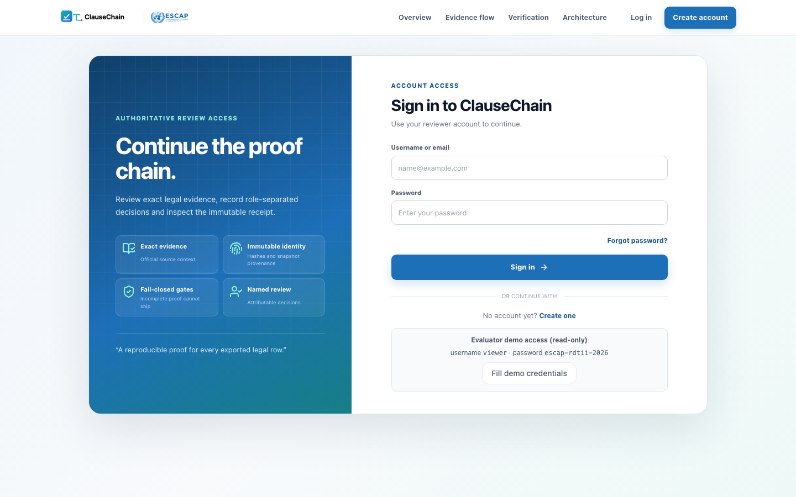
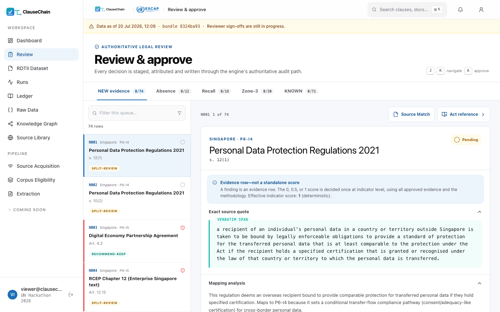
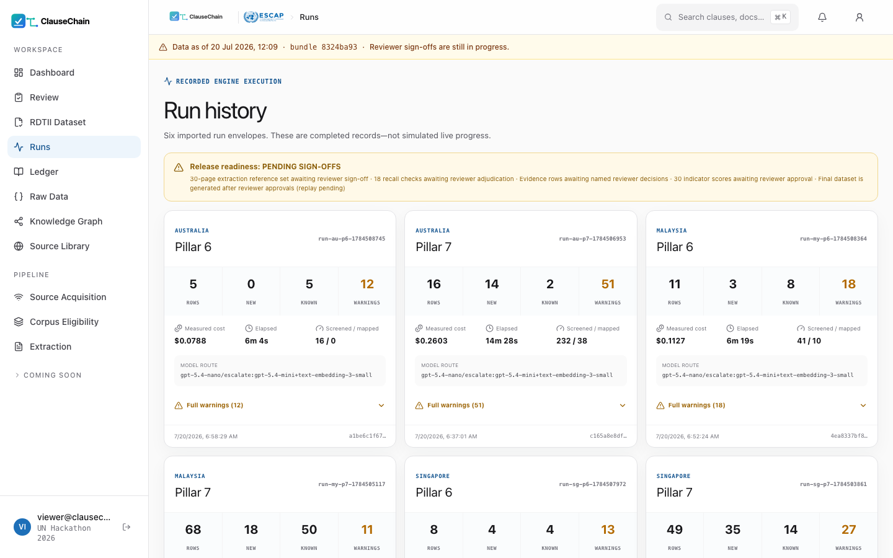
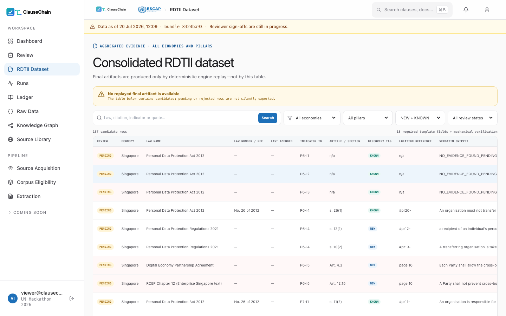
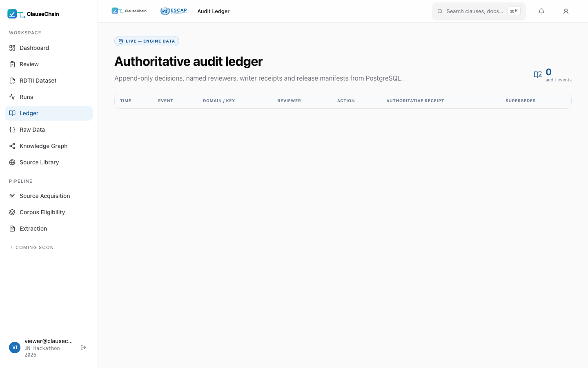
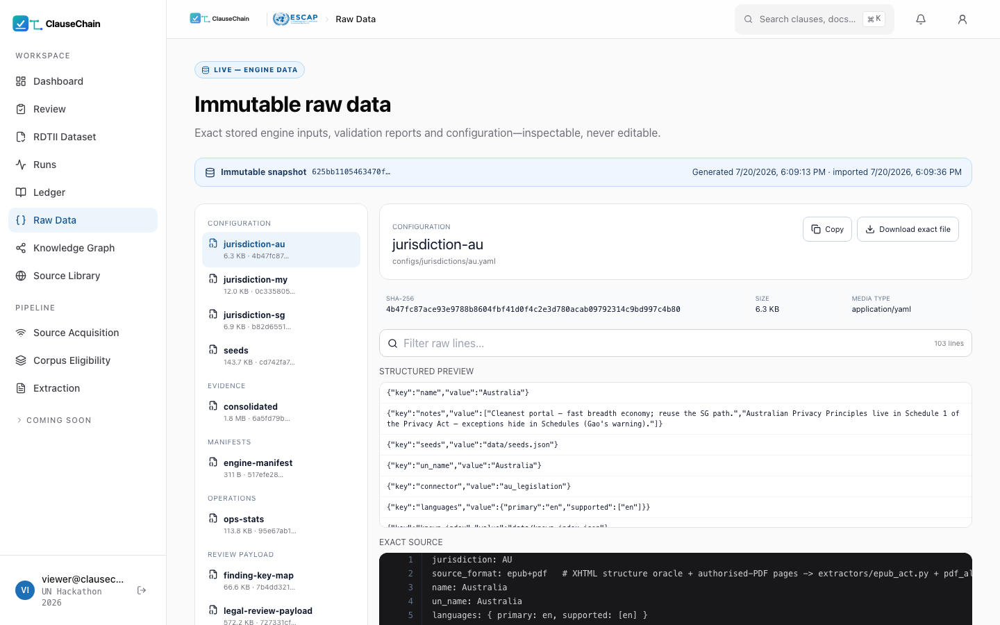
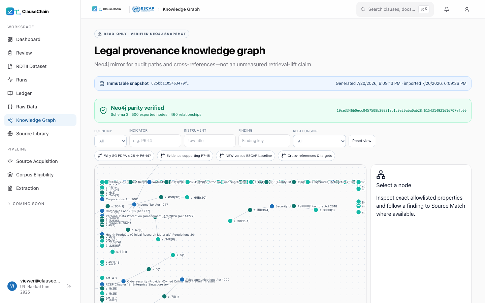
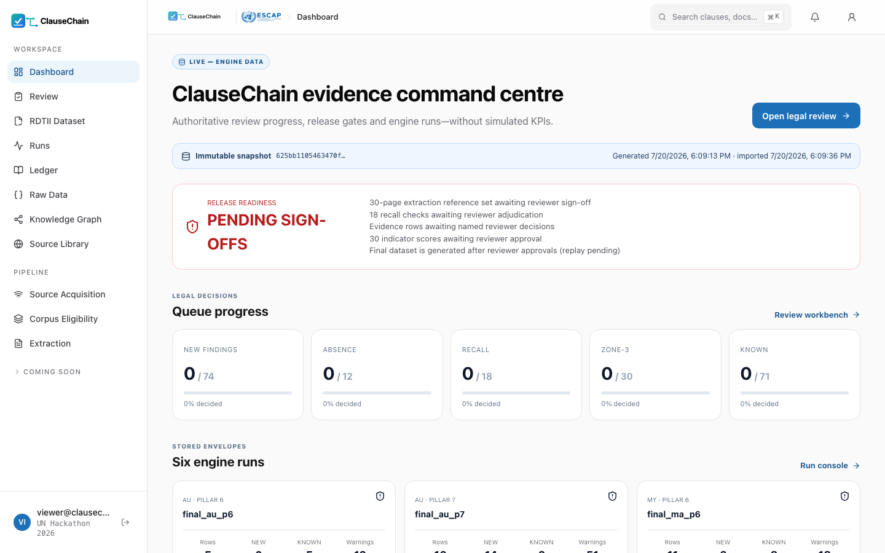
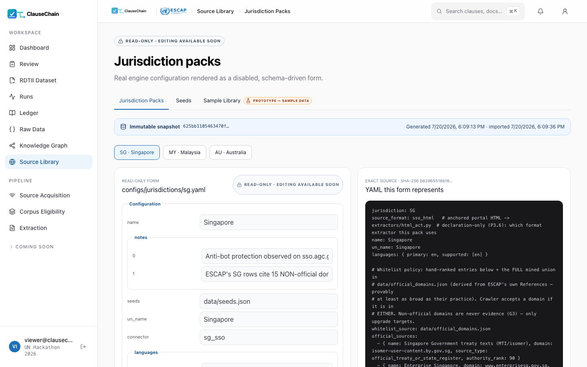

# ClauseChain Web Console — Screen-by-Screen Guide

**Live instance: https://clausechain.zai.bd** · read-only demo access is printed
on the login page. This guide walks every screen with real, unedited
screenshots from the live deployment.

The console is a *mirror with receipts*: it displays immutable, content-hashed
snapshots of engine artifacts and writes review decisions back through the
engine's own sanctioned decision CLI. It never invents data — if something is
unavailable, it says so and shows why.

---

## 1 · Signing in

- **Evaluator demo access (read-only)** is printed at the bottom of the form:
  username `viewer`, password `escap-rdtii-2026`, with a one-click
  **Fill demo credentials** button.
- The demo account can browse everything and write nothing. Review roles
  (citation / mapping / status reviewer) are Django groups; an account without
  them is read-only by construction, and launching engine runs additionally
  requires an administrator.

## 2 · Dashboard — the command centre

- **Release readiness** is the first card. It reads `PENDING SIGN-OFFS` until
  every human obligation is closed (reviewer decisions, indicator-score
  approvals, reference-set sign-off, final replay). The system does not flatter
  itself: readiness is computed by the engine's release-contract validator.
- **Queue progress** shows decided/total for the five review queues (NEW,
  Absence, Recall, Zone-3, KNOWN) — each links into the review workbench.
- **Six engine runs** summarises the stored run envelopes: rows produced,
  NEW/KNOWN split, warnings, elapsed time, and measured cost per run.
- The **snapshot banner** at the top names the exact engine snapshot (content
  hash + timestamps) every number on the page comes from.

## 3 · Review — the legal workbench

The heart of the console. For each finding:

- **Exact source quote** — the verbatim span, highlighted, verified
  byte-for-byte against the archived official copy (gate G1).
- **Mapping analysis** — why the engine mapped this provision to this
  indicator, with the rubric context.
- **Refuter verdict chips** — an adversarial second model attacks every NEW
  row before a human sees it (`RECOMMEND-KEEP` / `SPLIT-REVIEW` /
  `RECOMMEND-REJECT`) to triage attention.
- **Staged, role-separated sign-off** — citation review, mapping review and
  status review are separate stages; the same person cannot hold both the
  citation and mapping pens on a row. Every decision is written through the
  engine's decision CLI with an append-only receipt.
- Queue tabs across the top switch between NEW evidence, Absence review,
  Recall checks, Zone-3 scores and KNOWN baseline rows.

## 4 · Runs — accountable engine execution

- Every run is a stored envelope: economy, pillar, rows, NEW/KNOWN counts,
  **measured cost**, elapsed time, the exact **model route** that produced it,
  and the full warning list in the open.
- Administrators can queue a real run from here. It executes on a dedicated
  worker that only accepts argv templates from a reviewed allowlist —
  no shell, ever. Output is captured and hashed into the action record.

## 5 · RDTII Dataset — the consolidated evidence

- The aggregated evidence table across all economies and pillars, with
  per-row gate summaries and review state.
- **Final artifacts are produced only by deterministic engine replay** from
  named approvals — never by this table. Administrators can trigger the
  approval-replay from here; everyone else sees the release state.

## 6 · Ledger — append-only decision receipts

- Every review decision ever written, with reviewer names, roles, timestamps
  and supersession history. Nothing is deleted; corrections append.
- Exported decision bundles are content-hashed, so the trail is verifiable
  outside the app.

## 7 · Raw Data — the artifact explorer

- The immutable source artifacts behind every citation: official URL, archive
  hash (SHA-256), access date, extraction route, per-page OCR confidence where
  applicable.

## 8 · Knowledge Graph — provenance you can walk

- The corpus (≈54,000 provisions) as an Instrument → Section → Provision graph
  with cross-reference edges — follow a "subject to section 26" chain
  instantly.
- The green badge means the Neo4j mirror is **parity-verified** against the
  judged SQLite store (schema version, provision counts per economy, artifact
  counts). If parity fails, the screen says so instead of rendering stale data.
- Preset queries answer judge-style questions ("Why SG PDPA s.26 → P6-I4?",
  "Evidence supporting P7-I5", "NEW versus the ESCAP baseline").

## 9 · Pipeline screens — watching evidence arrive

- **Source Acquisition** — every configured official source with its fetch
  status, archive hash and access date. Dead links stay visible: an
  unresolved acquisition blocks absence conclusions instead of hiding.
- **Corpus Eligibility / Extraction** — which documents entered the judged
  corpus, which were quarantined (drafts, non-official mirrors, structure
  failures) and why.

## 10 · Source Library

- The per-jurisdiction source packs: official portals, whitelisted domains,
  citation grammar, status assertions — the data that makes adding an economy
  a configuration change rather than a code change.

---

## Access model at a glance

| Capability | Demo viewer | Reviewer (role group) | Administrator |
| :--- | :---: | :---: | :---: |
| Browse every screen | ✅ | ✅ | ✅ |
| Write review decisions | ❌ | ✅ (own role stage only) | ✅ |
| Launch engine runs / replay | ❌ | ❌ | ✅ |

## Running it yourself

- Backend (Django API + engine worker): [backend/README.md](backend/README.md)
- Frontend (Next.js console): [frontend/README.md](frontend/README.md)
- The engine itself needs neither — see the root [README.md](README.md).
